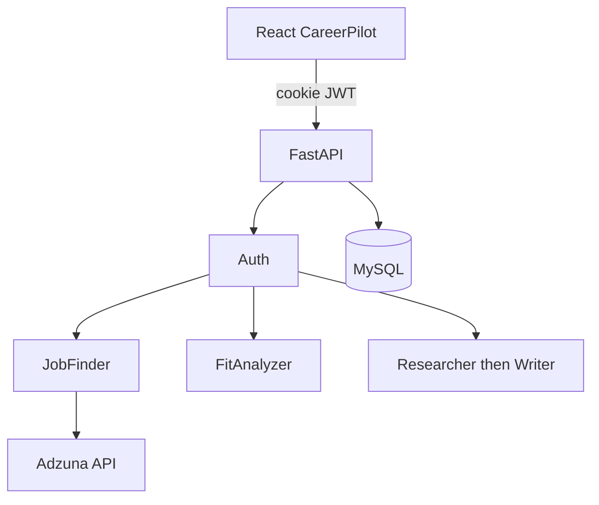

# CareerPilot — AI Career Agent

Find jobs from a saved profile, score your chances, generate tailored applications, and track outcomes.

**Stack:** React + FastAPI + MySQL 8 + Groq. Job search uses the official Adzuna API.

## Architecture



## Quick start

### 1. Python deps

```bash
python -m venv .venv
.venv\Scripts\activate
pip install -r requirements.txt
```

### 2. MySQL

```sql
CREATE DATABASE careerpilot CHARACTER SET utf8mb4 COLLATE utf8mb4_unicode_ci;
CREATE USER 'careerpilot'@'localhost' IDENTIFIED BY 'your_password';
GRANT ALL ON careerpilot.* TO 'careerpilot'@'localhost';
```

Copy `.env.example` to `.env` and set `MYSQL_PASSWORD`, `GROQ_API_KEY`, `JWT_SECRET`, and Adzuna keys.

Tables are created on API startup (`create_all`). Optional migrations:

```bash
alembic -c backend/alembic.ini upgrade head
```

### 3. Frontend + API

```bash
npm run install:all
npm run dev:server
npm run dev:frontend
```

Open http://localhost:5173 — register, save a profile, then Find jobs.

## Auth

Email + password. JWT is stored in an httpOnly cookie. All `/api/*` routes except register, login, and health require a session.

## API

| Method | Path | Description |
|--------|------|-------------|
| `POST` | `/api/auth/register` | Create account |
| `POST` | `/api/auth/login` | Sign in |
| `POST` | `/api/auth/logout` | Clear cookie |
| `GET` | `/api/auth/me` | Current user |
| `GET/PUT` | `/api/profile` | Seeker profile |
| `POST` | `/api/searches` | Search + fit score |
| `GET` | `/api/jobs` | Ranked feed |
| `POST` | `/api/jobs/manual` | Paste a job |
| `POST` | `/api/jobs/:id/prepare` | Researcher → Writer |
| `GET/PATCH` | `/api/applications` | Tracker |
| `GET` | `/api/insights` | Strategy lite |
| `GET` | `/api/health` | Health |

Applications are prepared for you to submit. CareerPilot does not auto-apply.

## Python CLI

```bash
python -m job_agent --company "Anthropic" --job-file examples/sample_job.txt --resume-file examples/sample_resume.txt
```
