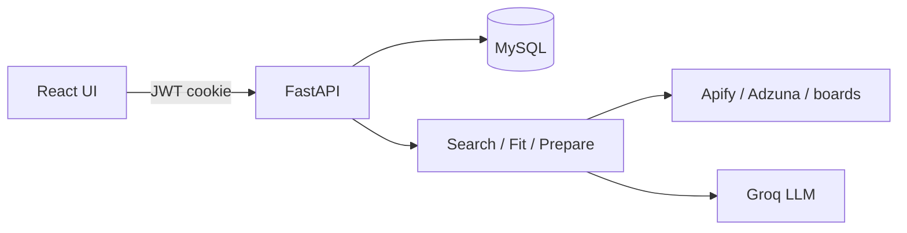

# CareerPilot

AI career agent that finds jobs from your profile, scores fit (APPLY / MAYBE / SKIP), and helps you prepare applications — without auto-applying.

> **Deployment:** Coming soon. Local development is fully supported today.

## Features

- Profile-driven job search (Indeed / LinkedIn via Apify, with optional Adzuna and public boards)
- Fit scoring with strengths, gaps, and recommendation labels
- Application preparation pipeline (research → draft) for you to submit
- Cookie-based JWT auth and a React job matches UI

## Stack

| Layer | Technology |
|-------|------------|
| Frontend | React, Vite, Tailwind CSS |
| Backend | FastAPI, SQLModel |
| Database | MySQL 8 |
| LLM | Groq |
| Job sources | Apify Store actors, Adzuna, Remotive, The Muse |

## Architecture



CareerPilot does **not** auto-apply. Official job APIs and Apify Store actors only — no custom scrapers.

## Prerequisites

- Python 3.10+
- Node.js 18+
- MySQL 8
- [Groq API key](https://console.groq.com/)
- Optional: [Apify token](https://console.apify.com/) and/or Adzuna credentials

## Quick start

### 1. Clone and configure

```bash
git clone <repo-url>
cd ai_job_application_agent
cp .env.example .env
```

Edit `.env` and set at least:

```env
GROQ_API_KEY=...
JWT_SECRET=...
MYSQL_PASSWORD=...
JOB_PROVIDER=apify   # or auto / adzuna
APIFY_API_TOKEN=...  # when using Apify
```

### 2. MySQL

```sql
CREATE DATABASE careerpilot CHARACTER SET utf8mb4 COLLATE utf8mb4_unicode_ci;
CREATE USER 'careerpilot'@'localhost' IDENTIFIED BY 'your_password';
GRANT ALL ON careerpilot.* TO 'careerpilot'@'localhost';
FLUSH PRIVILEGES;
```

Tables are created on API startup. Optional migrations:

```bash
alembic -c backend/alembic.ini upgrade head
```

### 3. Backend

```bash
python -m venv .venv
# Windows
.venv\Scripts\activate
# macOS / Linux
source .venv/bin/activate

pip install -r requirements.txt
uvicorn backend.app.main:app --reload --port 8000
```

Health check: [http://127.0.0.1:8000/api/health](http://127.0.0.1:8000/api/health)

### 4. Frontend

```bash
npm run install:all
npm run dev:frontend
```

Open [http://localhost:5173](http://localhost:5173), register, save a profile, then **Find jobs**.

### One-command helpers

| Script | Purpose |
|--------|---------|
| `npm run install:all` | Install frontend deps |
| `npm run dev:server` | API on port 8000 |
| `npm run dev:frontend` | Vite dev server |
| `npm start` | Build frontend + serve API |

## Environment

See [`.env.example`](.env.example) for the full list. Common keys:

| Variable | Description |
|----------|-------------|
| `GROQ_API_KEY` | Groq API key |
| `GROQ_MODEL` | Model id (default: `openai/gpt-oss-120b`) |
| `JWT_SECRET` | Cookie JWT signing secret |
| `MYSQL_*` / `DATABASE_URL` | MySQL connection |
| `JOB_PROVIDER` | `auto`, `apify`, `adzuna`, etc. |
| `APIFY_API_TOKEN` | Apify token |
| `APIFY_ACTOR` | Actor id (default: `khadinakbar/jobs-scraper`) |
| `APIFY_PLATFORMS` | e.g. `indeed,linkedin` (Glassdoor omitted) |
| `ADZUNA_APP_ID` / `ADZUNA_APP_KEY` | Optional Adzuna |

Never commit `.env`.

## API overview

| Method | Path | Description |
|--------|------|-------------|
| `POST` | `/api/auth/register` | Create account |
| `POST` | `/api/auth/login` | Sign in |
| `POST` | `/api/auth/logout` | Clear cookie |
| `GET` | `/api/auth/me` | Current user |
| `GET` / `PUT` | `/api/profile` | Seeker profile |
| `POST` | `/api/searches` | Search + fit score |
| `GET` | `/api/jobs` | Ranked job feed |
| `POST` | `/api/jobs/manual` | Paste a job |
| `POST` | `/api/jobs/:id/prepare` | Prepare application |
| `GET` / `PATCH` | `/api/applications` | Application tracker |
| `GET` | `/api/insights` | Strategy insights |
| `GET` | `/api/health` | Health |

Interactive docs (when the API is running): [http://127.0.0.1:8000/docs](http://127.0.0.1:8000/docs)

## Tests

```bash
pip install -r requirements.txt
pytest
```

## Project layout

```
backend/app/          # FastAPI app (core, api, services, integrations, workers)
frontend/src/         # React UI (features/jobs, auth, profile)
tests/                # Pytest suite
job_agent/            # Compatibility / CLI shims
.env.example          # Environment template
```

## Deployment

**Coming soon.** Production packaging, hosted environments, and release docs are planned. Until then, run locally with the steps above.

## License

Private / unpublished unless otherwise stated. All rights reserved.
